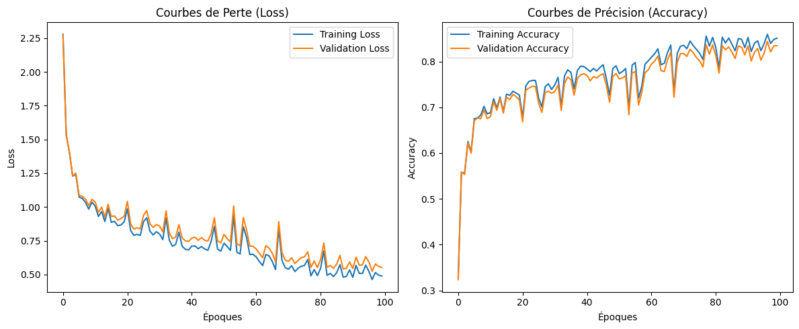
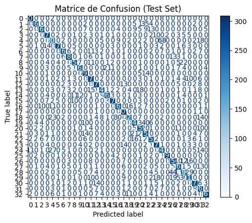

# tifinagh-mlp-recognition
# Handwritten Tifinagh Character Recognition (MLP from Scratch)

Implementation of a 4-layer Multilayer Perceptron (MLP) built from scratch in Python (NumPy) to classify 33 handwritten Tifinagh character classes from the AMHCD dataset.

## Features
- **Architecture**: 1024 -> 64 -> 32 -> 33
- **Activation Functions**: ReLU (hidden layers), Softmax (output)
- **Optimization**: Adam Optimizer
- **Regularization**: L2 Weight Regularization ($\lambda = 0.01$)
- **Test Accuracy**: **83.73%**

## Results
| Loss & Accuracy Curves | Confusion Matrix |
| :---: | :---: |
|  |  |

## Project Structure
- `Tifinagh_MLP_Recognition.ipynb`: Main Google Colab notebook containing code & execution logs.
- `main.tex`: Academic report source code written in LaTeX (IMRaD format).
- `loss_accuracy_plot.png` & `confusion_matrix.png`: Generated evaluation plots.
